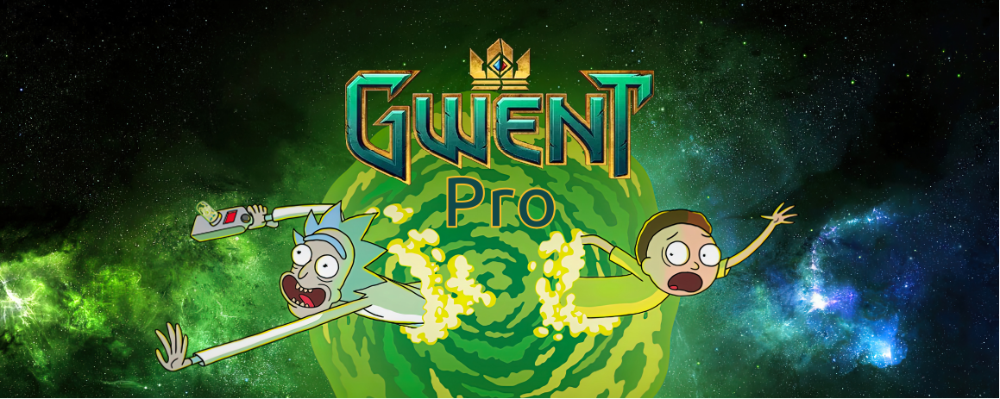

> Proyecto de Programación I
> Facultad de Matemática y Computación - Universidad de La Habana.
> Curso 2024

# Bienvenidos, intrépidos viajeros interdimensionales, a **Gwent-pro!** 🌌🚀

### En este juego, la realidad se retuerce como un portal de bolsillo y los límites entre dimensiones se desvanecen. ¿Estás listo para enfrentarte a criaturas cósmicas, enemigos misterioros y giros temporales? ¡Entonces prepárate para una experiencia alucinante!

### La trama te llevará desde la Tierra hasta un planeta desconocido para dirigir junto al líder del equipo que escogerás a continuación, una épica batalla interdimensional. ¿Por qué? Porque sí. Y porque Rick lo dijo. 
### Te esperan diálogos sarcásticos, referencias a la cultura pop y chistes que desafían las leyes de la física.

### Requisitos para jugar:
### - Mente abierta: Deja tus expectativas en la puerta. Aquí, las reglas son flexibles y la lógica es opcional.
### - Amor por lo absurdo: Si alguna vez te preguntaste qué pasaría si un pepinillo gobernara el mundo, este es tu juego.
### - Ganas de reír: Porque, sinceramente, ¿quién no necesita más risas en su vida?

### Así que, aventureros, ajusten sus cinturones multiversales y prepárense para una montaña rusa de locura. ¡Nos vemos en la batalla! 🌟🌮👽

## Preste atención!!

Requisitos para jugar
* La resolución de su pantalla debe ser 1920 x 1080. Esto es necesario para que no se distorsionen determinados elementos visuales.
* Debe estar trabjando en alguna distribución de Linux.
* Usted debe correr el ejecutable ´GwentR&M.x86_64´ que se encuentra dentro de la carpeta GwentR&M en la carpeta principal.
* Se recomienda leer el fichero GwentR&MGuide.pdf que se encuentra en la carpeta principal, este contiene una descripción de las reglas del juego y tips para mejorar su experiencia durante la partida.

# Autor
##### Hecho por Lianny Revé Valdivieso
##### Grupo C122
